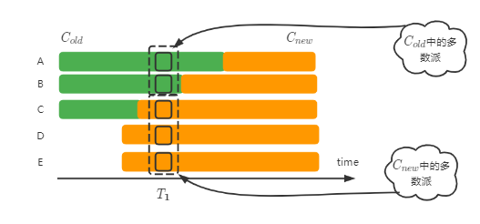

## ProposalNo怎么生成？
为每个Proposer设定一个编号I（I≥0），在生成提案编号时，使用公式N×J＋I（N为Proposer个数，J属于每个Proposer本地提出的提案顺序）来生成。假设存在3个Proposer，其编号分别为0、1、2，生成的提案编号如下所示：

 | Proposer | 第1个提案 | 第2个提案 | 第3个提案 | 第4个提案 | 第5个提案 | 
 |:-----:| :-----: | :-----: | :-----: | :-----: | :-----: | 
 | Proposer0 |   3   | 6 | 9 | 12 | 15 | 
 | Proposer1 |   4   | 7 | 10 | 13 | 16 | 
 | Proposer2 |   5   | 8 | 11 | 14 | 17 | 


## 是否真的能支持并行协商？
并行协商是指多个Instance同时协商
在Basic-Paxos中，并没有对并行协商做过多的限制，事实上也是如此，每个Instance上都运行一轮Paxos，它们并不会互相干扰。

在Multi-Paxos中，我们优化掉了Prepare阶段，而Prepare阶段是保证已达成共识的提案不再改变的关键逻辑，这个优化过后的算法是否还能支持并行协商？我们看下面的案例

```
使用<instanceId, proposalNo>标识一个提案
A: pre<2, 1> → A, C
A: acc<2, 1> → A, C    reach consensus.

B-T1: pre<2, 1>           network failure.
B-T1: pre<2, 2>           network failure.
B-T1: wait
B-T2: pre<3, 3> → A, B, C
B-T1: notify, acc<2, 3>   once again reach consensus.
```
可以看到在上述的案例中，原本达成共识的提案是<2, 1>，而最终却变成了<2, 3>，明显在ProposalNo为2和3上可以提出不同的值。此时的算法是不安全的。

那么在Multi-Paxos如何能并行协商呢？我们需要修改Prepare的逻辑。

```
origin paxos handle prepare request:
    if(msg.proposalNo > local.proposalNo) {
        return <granted, local.value>;
    } else {
        return <refuse, null>;
    }

klein paxos handle prepare request:
    if(msg.proposalNo > local.proposalNo) {
        msgId = msg.instanceId;
        localValues = local(value with PREPARED/ACCEPTED status within [0, msgId)); 
        return <granted, localValues>;
    } else {
        return <refuse, null>;
    }
```
修改过后的Prepare相当于对当前所有的Instance都进行了Prepare阶段，那么在Accept选择值时，就可以直接从Prepare的响应中获取了。

不过在Prepare的响应中携带所有的instance，是不现实的。针对于此，有两个可优化的地方
- 我们需要引入快照，只携带快照以外的instance。
- 只携带非CONFIRMED的instance。

对于第二点，如果某个instance是CONFIRMED，那么其他成员是感知不到，其他成员仍然可以以自己的值发起提案，因此，还需要修改Acceptor处理accept请求的逻辑：
```
origin paxos handle accept request:
    if(msg.proposalNo >= local.proposalNo) {
        return <granted>;
    } else {
        return <refuse>;
    }

klein paxos handle accept request:
    if(local.instance.state == CONFIRMED) {
        // 
        return <refuse, local.instance>;
    }
    if(msg.proposalNo >= local.proposalNo) {
        return <granted, localValues>;
    } else {
        return <refuse, null>;
    }

```

## 到底哪个提案会达成共识？
```
A: pre<2, 1> → A, C
A: acc<2, 1> → A

B: pre<2, 2> → B, C
B: acc<2, 2> → B

C: pre<2, 3> → A, C     -----> 1
C: pre<2, 3> → B, C     -----> 2
```

## Confirm阶段（应用状态转移）是否真的可以异步执行？
- 无返回值的写请求可以
- 有返回值的写请求、读请求不行


## 如何为一个运行的系统创建快照？
先为状态机创建一个镜像，然后为镜像创建快照

## Group的拆分是否有必要完全隔离？
作为一个共识类库，拆分Group是行业内通用的优化手段，这样做几个好处：
- 最大限度的利用计算资源
- 提高协商效率

解释一下这两个好处，以Raft为例，Raft是一个串行协商的共识算法，一个Instance需要等到上一个Instance完成后才能协商。
因此，Raft同一时间只有一个Instance协商，这样的设计，势必有很大的CPU资源空闲着，而拆分Group，可以使得一个Raft集群服务于多个Group，每个Group负责互不干扰的业务，拆分的Group越多，使用CPU资源越多；
第二个好处，是因为Raft是串行协商的，单个协商效率虽然很高，但是面对复杂的生产业务，协商效率不行的，所以也需要拆分Group，使得Group与Group之间能并行协商。

而Klein作为一个内嵌式的库，跟其他的共识库不同。我们没必要执迷于把计算资源耗尽，相反我们希望把更多的计算资源留给业务系统。
因此拆分Group虽然有必要，但是没必要完全隔离出Proposer、Acceptor、Learner角色，只需要隔离Instance即可，原因有以下几个：

- 因为基于Paxos的乱序协商，不会受到串行协商的限制，因此整体的协商效率与完全隔离不会相差很多。
- 另外不隔离Proposer等角色，各个Group之间还可以共享Prepare阶段，进一步减少执行Prepare阶段的次数。
- 还有一个原因是，Klein作为一个内嵌库，所实现的功能往往是单一的，很少遇到负责的业务场景。

这样分析下来，只隔离Instance的协商效率会更高，因此只隔离Instance是一个高效且正确的决定。

## 是否需要权威节点？
如果仅仅是为了协商提案，使得数据在各个成员中达成共识，这确实没必要引入中央权威节点。
然而解决生产场景下复杂的问题，中央权威解决仍是必须的，但是我们不能因此降低Paxos的灵活性，以及可用性，那么如何设计这个中央权威节点，变得至关重要。
Klein引入Master角色，该角色在集群中，同一时间只允许存在一个。Master存在的作用，是为了解决成员变更、优化读请求。

### 成员变更
成员变更，当然可以让其作为一个提案，使用Paxos进行协商。但是这面临一个问题，如何保证变更中的数据安全性。如下图所示（绿色为旧配置，橙色为新配置），
在T1时间的虚线框中，存在两个多数派：新配置的多数派和旧配置的多数派，并且它们互相感知不到，仍然可以向客户端提供写服务，那么就会造成，一个instance上有两个提案达成共识。


怎么解决这个问题呢？通常的做法是，引入配置版本号，它是一个单调递增的整数，约定高版本号的成员不允许投票给低版本号的成员，并且要求(两个阶段或者一次只变更一个成员)，
这样使得旧配置和新配置，一定存在一个相交的成员，而这个相交的成员的版本号就保证了在一个instance上只有一个提案达成共识。

这里最关键的地方在于，版本号怎么生成，如果每个成员各自在本地维护版本号，那么一定会有版本冲突的情况，所以我们需要一个权威的成员来生成版本号，即Master。

### 优化读请求、数据对齐
由于Paxos的读请求，也需要进行一轮协商，这是很慢的。
有了Master角色，约定写请求一定要复制到Master才算成功，这样虽然降低了协商成功的概率，但是这种优化是非常必要的。并且我们只需要保证Master的稳定性，那么写请求一定复制到Master这个条件并不苛刻。
因为所有的写请求都会复制到Master，那么Master一定拥有最完整的数据，那么读请求就可以直接请求Master来完成了。

另外数据对齐也是同样的道理，新成员上线，可直接向Master索取最新的数据。

## Master怎么选举？
选举Master的本质，就是让所有成员都认同某一个成员的权威地位，那么解决共识问题，还得是共识算法。
我们可以让Master选举作为一个状态机，挂载在Paxos集群上，选举Master则为一个提案，在集群中进行协商，该提案达成共识，也就意味着Master选举成功


## 成员变更

https://www.microsoft.com/en-us/research/publication/stoppable-paxos/

### 成员变更需要等待上一个生效后才能进行

{A, B, C} → {A, B, C, D}

T1时刻正在协商的提案：（P为普通提案，R为成员变更）

| instance |  1  |  2  |  3  |  4  |  5  | 
|:-----:|:---:|:---:|:---:|:---:|:---:| 
| content |  P  |  P  |  R  | P  | P  |

此时集群中仍然是旧配置，包括4和5，甚至他们仍可能使用旧配置达成共识,
但是并不需要担心安全性，在一次只能变更一个成员的情况下，新配置和旧配置一定存在相交的成员，
因此新配置一定可以感知到旧配置达成共识的提案，不必担心已达成共识的提案会被改变。

T2时刻收到新的成员变更{A, B, C, D, E}

| instance |  1  |  2  |  3  |  4  |  5  |  6  |
|:-----:|:---:|:---:|:---:|:---:|:---:|:---:|  
| content |  P  |  P  |  R  | P  | P  |  R  |
则需要先等待instance 3先被执行状态转移后才能协商。
3未执行状态转移前，集群中配置仍然是{A, B, C}
