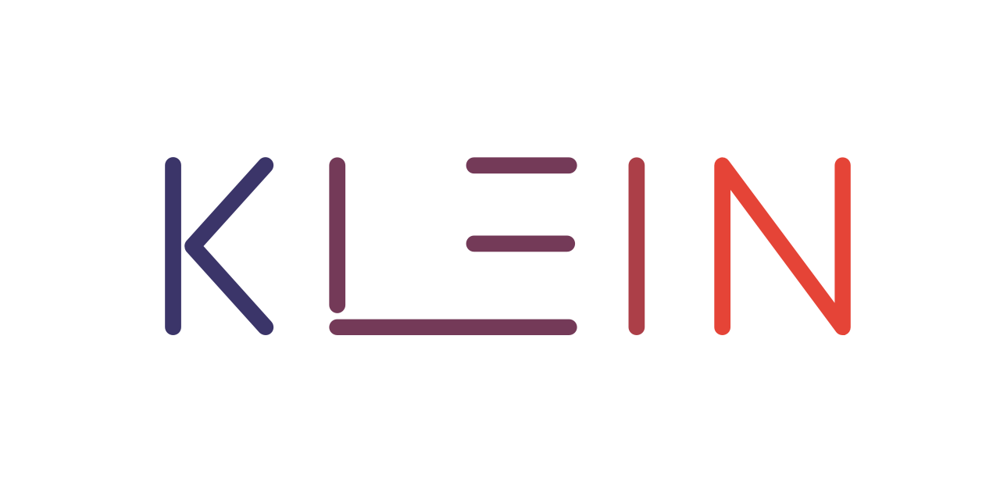

# Introduce

Klein is a Paxos based distributed collection tool library, including distributed ArrayList, distributed HashMap, distributed Cache, distributed Lock, etc..

In addition, based on Paxos, we can imagine endlessly, such as: KV-storage, Registry, Configuration center, etc.

We hope that Klein can be deployed independently or embedded in your project. You can use it just like Redis,
or embed Klein into your project without relying on any middleware to ensure data consistency among members. Of course,
this is still in the process of implementation. 😆😆😆

**Look forward to your star⭐**

## Cache/K-V storage
- Control the number of buffers based on LRU
- Cache Automatic Expiration (TTL)
## Lock

# Milepost

## Evolve
### Paxos
- [x] Write request, disordered negotiation, sequential confirmation
- [x] Read request, using negotiation log
- [x] Batch negotiation
- [x] Optimize the prepare phase
- [x] Snapshot
- [x] To split roles such as Group and proposer, you only need to isolate instance instead of isolating them
- [x] Master role：
  - [x] Change of members
  - [x] The master promotion should have the most complete data (the master should be elected through negotiation with the proposal. If the promotion is successful, the previous instances must be applied)
  - [x] Keep data consistent
    - [x] Master heartbeat triggers data synchronization
    - [x] Snapshot synchronization (the heartbeat carries the checkpoint and the learn message returns the checkpoint)
    - [ ] ~~New members join the cluster and actively learn from the master~~
  - [ ] Optimize read requests (write requests must be copied to the master)
  - [ ] Optimize write requests (write requests can only be executed by the master to avoid livelocks)
- [ ] Automatic member discovery (research)
- [ ] NWR
- [ ] Confirm Optimize read requests
- [ ] There is no interference key, so a round of Prepare is unnecessary
- [ ] Verified by jepsen

### Cache
- [x] Basic functions such as reading, writing, etc
- [ ] Implement LRU with persistence
- [x] Cache Automatic Expiration (TTL)

### Collection
- [ ] list
- [ ] map

### To be optimized
- [ ] LogManager row lock
- [ ] Monitor negotiation efficiency
- [ ] Monitoring thread pool indicators (DefaultTimer, ThreadExecutor)
- [x] ProposalNo全局唯一
- [ ] 状态机持久化（master、lock）

# Design ideas
[Paxos](klein-consensus/klein-consensus-paxos/readme.md)
- How to generate ProposalNo?
- Can parallel negotiation really be supported?
- Which proposal will reach consensus?
- Can the Confirm phase (application state transition) really be executed asynchronously?
- How do I create a snapshot of a running system?
- Is it necessary to completely isolate the splitting of a group?
- Optimize the Prepare phase
- Batch negotiation (queue) to reduce RPC interaction